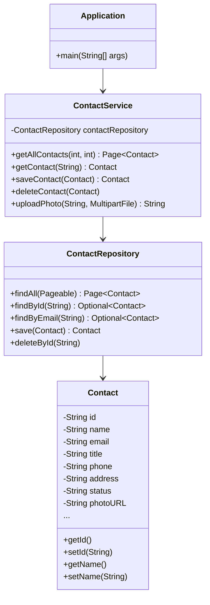

# Class Diagram

```mermaid
classDiagram
    class Application {
        +main(String[] args)
    }

    class Contact {
        -String id
        -String name
        -String email
        -String title
        -String phone
        -String address
        -String status
        -String photoURL
        +getId()
        +setId(String)
        +getName()
        +setName(String)
        ...
    }

    class ContactRepository {
        +findAll(Pageable) Page~Contact~
        +findById(String) Optional~Contact~
        +findByEmail(String) Optional~Contact~
        +save(Contact) Contact
        +deleteById(String)
    }

    class ContactService {
        -ContactRepository contactRepository
        +getAllContacts(int, int) Page~Contact~
        +getContact(String) Contact
        +saveContact(Contact) Contact
        +deleteContact(Contact)
        +uploadPhoto(String, MultipartFile) String
    }

    Application --> ContactService
    ContactService --> ContactRepository
    ContactRepository --> Contact
```

This diagram shows the main classes and their relationships. The application uses Spring Boot's dependency injection to wire the service and repository.