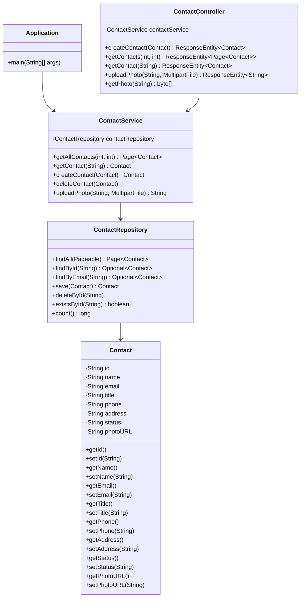

# Class Diagram

This diagram shows the main classes and their relationships in the Contact API application. The application uses Spring Boot's dependency injection to wire the components together. The `Contact` entity is annotated with JPA annotations for database persistence, while the `ContactRepository` extends `JpaRepository` for data access operations. The `ContactService` contains business logic, and the `ContactController` handles HTTP requests and responses.