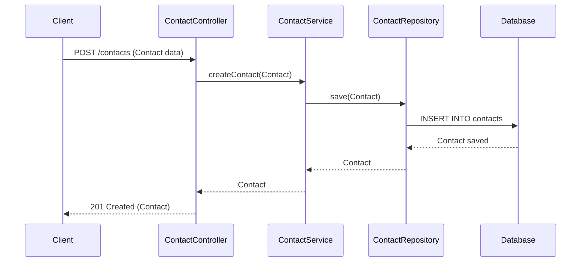
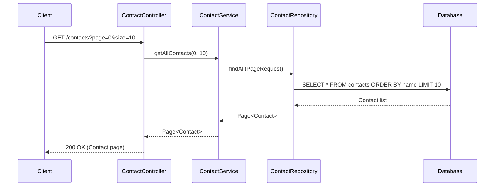
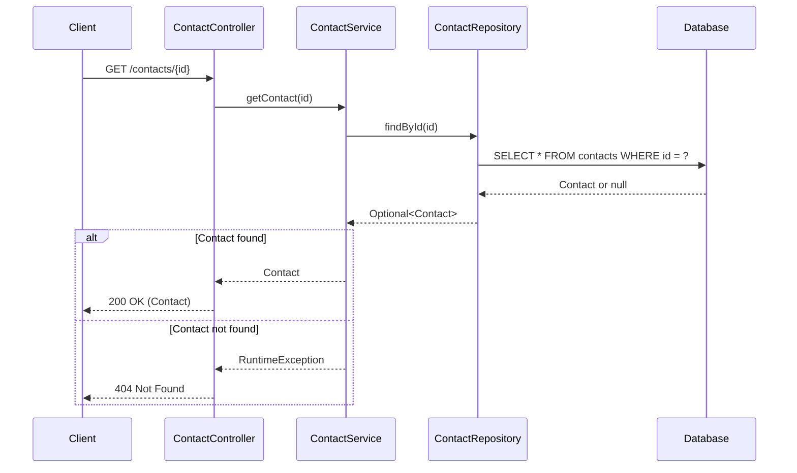
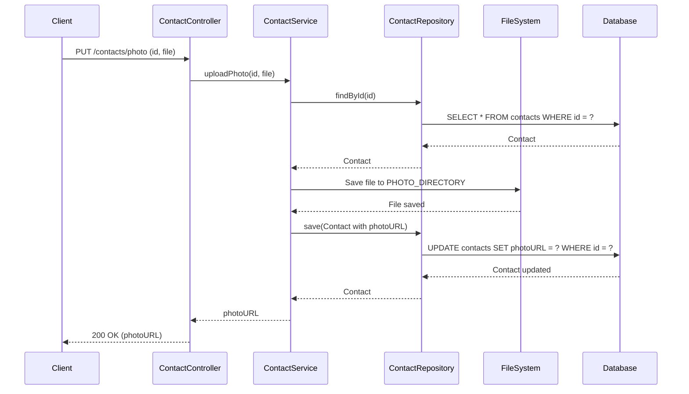
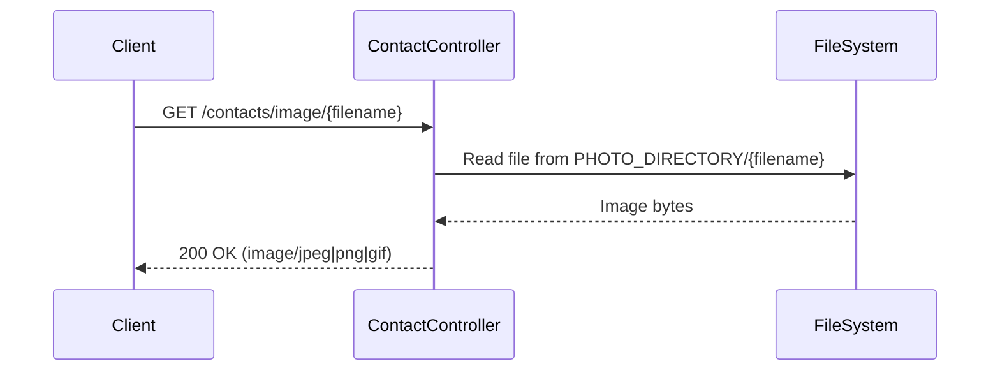

# Sequence Diagrams

## Create Contact Flow

## Get Contacts Flow

## Get Single Contact Flow

## Upload Photo Flow

## Get Photo Flow

These sequence diagrams illustrate the main interaction flows in the Contact API. The application follows a typical layered architecture with the controller handling HTTP requests, the service containing business logic, the repository managing data access, and external systems like the database and file system providing persistence.