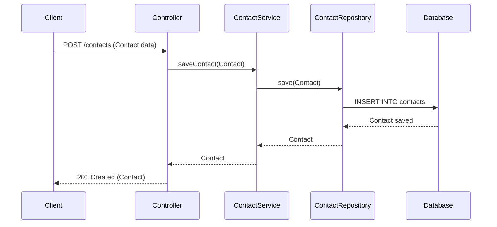

# Sequence Diagram

```mermaid
sequenceDiagram
    participant Client
    participant Controller
    participant ContactService
    participant ContactRepository
    participant Database

    Client->>Controller: POST /contacts (Contact data)
    Controller->>ContactService: saveContact(Contact)
    ContactService->>ContactRepository: save(Contact)
    ContactRepository->>Database: INSERT INTO contacts
    Database-->>ContactRepository: Contact saved
    ContactRepository-->>ContactService: Contact
    ContactService-->>Controller: Contact
    Controller-->>Client: 201 Created (Contact)
```

This sequence shows the flow for creating a new contact.